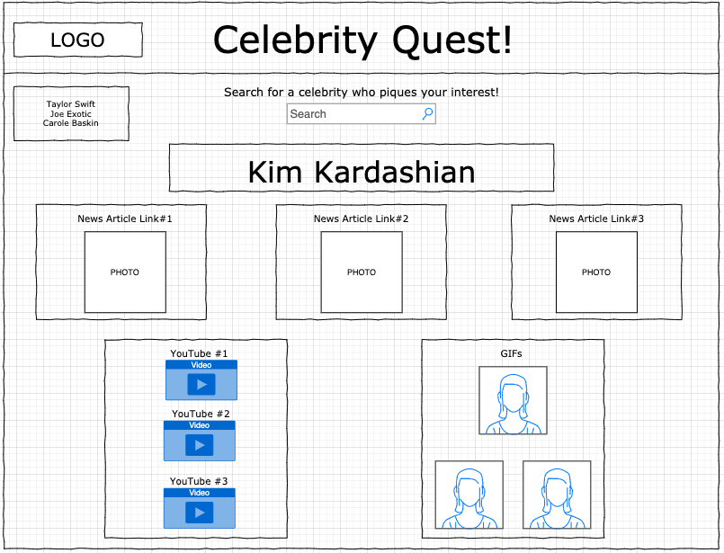
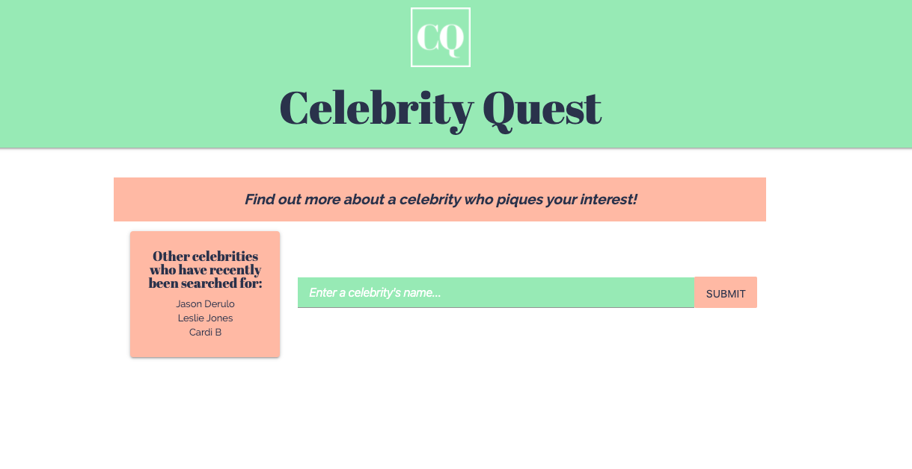
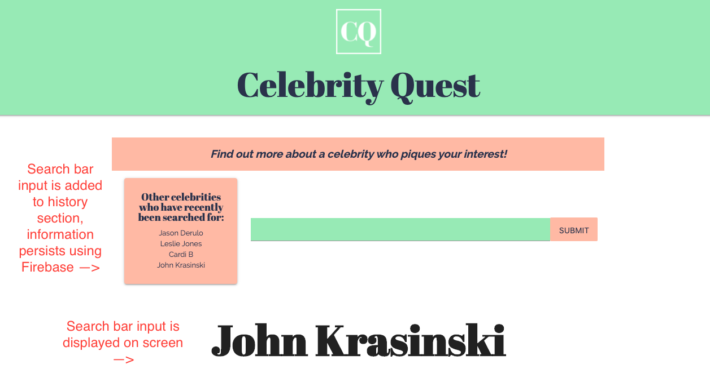
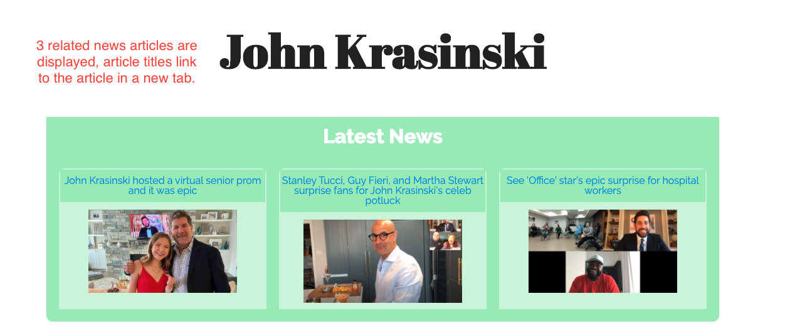
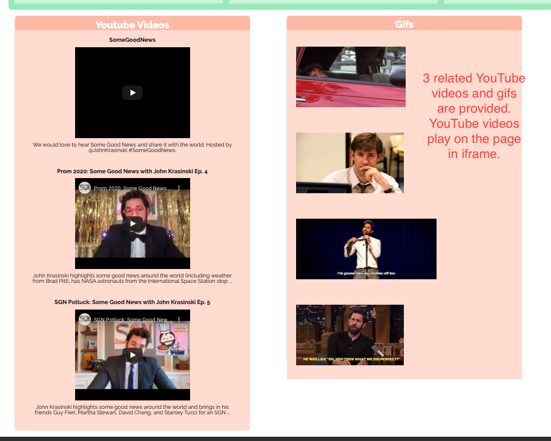

# Project-1

1. Purpose of the app: To be able to search for a celebrity and access several types of content related to that celebrity on one page, including YouTube videos, news articles, and gifs.

2. Team Members: Ashley Waldner, Melanie Jindali, Tashona Smith

3. I personally was responsible for the Javascript and CSS for the newsapi.org API, as well as designing the page's logo icon.  We all worked together to create the HTML structure and create an overall design theme.

4. This app was created using the YouTube API, the Giphy API, newsapi.org API, Firebase, and Materialize CSS library.

5. Wireframe:

6. Link to GitHub Pages 
     https://tashonasmith.github.io/Celebrity-Quest/

7. App screenshots:

